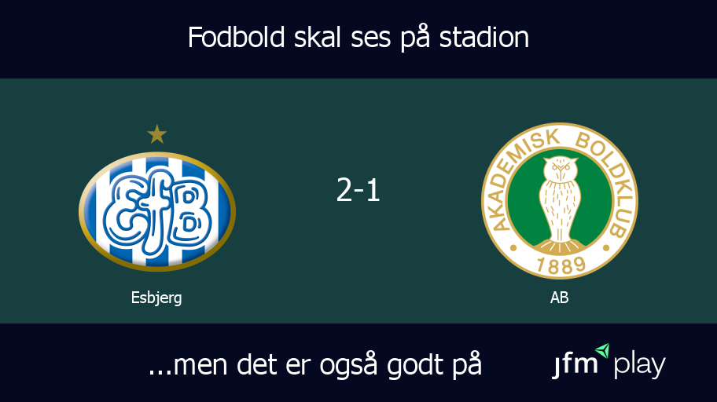
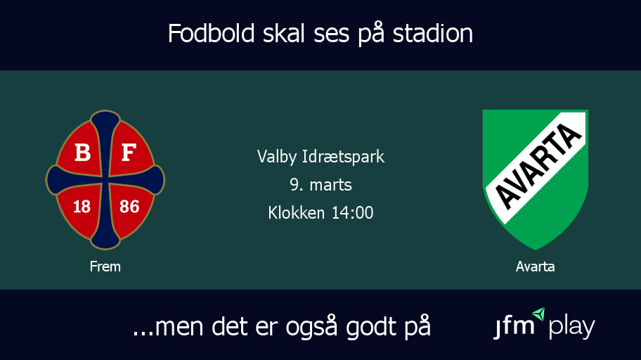

# Soccer Match Image Generator

This Node.js application generates custom images for soccer matches, including post-match results and pre-match information. Using the Express framework and the `canvas` library, the app dynamically creates images featuring soccer club logos, scores for concluded matches, or details (such as date, time, and venue) for upcoming matches.

## Features

- **Post-Match Results**: Generate images with the final score of the match.
- **Pre-Match Information**: Create images with details about an upcoming match, including stadium, date, and time.

## Getting Started

### Prerequisites

- Node.js
- npm

### Installation

1. Clone the repository.
2. Navigate to the project directory
3. npm install
4. Add your environment variables:
Create a `.env` file in the root directory and set `PORT` to your preferred port number. Example:
PORT=8000
5. Start the server:
npm start
The server will start running, and you can access it at `http://localhost:<PORT>`.


## Usage

### Generating Post-Match Results
 

**Endpoint:** `/generate/results`

**Method:** GET

**Query Parameters:**

- `team1`: Identifier for the first team.
- `team2`: Identifier for the second team.
- `score`: The final score of the match.
- `division`: The division or league of the teams.

**Example Request:**
GET /generate/results?team1=middelfart&team2=efb&score=2-1&division=2

This request generates an image with the logos of Arsenal and Chelsea, displaying the score "2-1".

### Generating Pre-Match Information


**Endpoint:** `/generate/info`

**Method:** GET

**Query Parameters:**

- `team1`: Identifier for the first team.
- `team2`: Identifier for the second team.
- `stadion`: The venue of the match.
- `date`: The match date.
- `time`: The match time.
- `division`: The division or league of the teams.

**Example Request:**
GET /generate/info?team1=naesby&team2=avarta&stadion=Næsby%20Stadion&date=3. marts&time=15:00&division=3

## Team Names Key

This application uses a key-value mapping to associate team identifiers with their full names or preferred display names. Here's a breakdown of the team identifiers that you should use in get-request and their corresponding names:

- `holstebro`: Holstebro
- `ishoj`: Ishøj
- `holbaek`: Holbæk B&I
- `avarta`: Avarta
- `vskaarhus`: VSK Århus
- `sfboure`: SfB-Oure
- `lyseng`: Lyseng
- `hik`: HIK
- `vejgaardb`: Vejgaard B
- `frem`: Frem
- `brabrand`: Brabrand
- `nykobing`: Nykøbing
- `thisted`: Thisted
- `ab`: AB
- `youngboys`: Young Boys
- `naesby`: Næsby
- `middelfart`: Middelfart
- `vanlose`: Vanløse
- `fa2000`: FA 2000
- `fremadamager`: Fremad Amager
- `roskilde`: Roskilde
- `efb`: Esbjerg
- `aarhusfremad`: Aarhus Fremad
- `skive`: Skive

# Example Usage of the Info API Endpoint with PHP

This guide demonstrates how to consume the `info` endpoint of our API using PHP. This endpoint generates pre-match information including date, time, and venue for given teams and division. The PHP script provided below is designed to download the resulting image file to your server.

## Requirements

- PHP with `curl` enabled
- Access to the running API server (the example assumes it's running locally on port 8000)
- Write permission in the directory where you want to save the image

## PHP Script

Below is the PHP script to make a GET request to the `info` endpoint. It constructs a URL with query parameters for the `team1`, `team2`, `stadion`, `date`, `time`, and `division` fields, and then saves the received image response to the server.

```php
<?php

// Replace these values with actual data
$team1 = 'Team1Name';
$team2 = 'Team2Name';
$stadion = 'StadiumName';
$date = 'YYYY-MM-DD';
$time = 'HH:MM';
$division = 'DivisionName';

// Path to save the downloaded image
$savePath = 'path/to/save/the/image.png';

// API endpoint and parameters
$baseUrl = 'http://localhost:8000/generate/info';
$queryParams = http_build_query([
    'team1' => $team1,
    'team2' => $team2,
    'stadion' => $stadion,
    'date' => $date,
    'time' => $time,
    'division' => $division,
]);

// Full URL with query parameters
$url = "{$baseUrl}?{$queryParams}";

// Initialize a cURL session
$ch = curl_init($url);

// Set options for the cURL request
curl_setopt($ch, CURLOPT_RETURNTRANSFER, true); // Return the transfer as a string of the return value of curl_exec() instead of outputting it directly

// Execute the cURL session
$response = curl_exec($ch);

// Close the cURL session
curl_close($ch);

// Check if the response is false
if ($response === false) {
    echo "Failed to get response from the API";
} else {
    // Save the response to a file
    file_put_contents($savePath, $response);
    echo "Image saved to '$savePath'";
}

?>